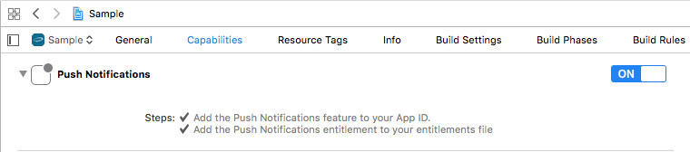

# Airship Unity Plugin 9.x to 10.0.0

Version 10.0.0 is a major rewrite of the plugin. The native layers were rewritten in
Swift (iOS) and Kotlin (Android), and the C# API was reorganized into feature modules.

## Raised requirements

- Unity 6
- iOS: Xcode 16+, minimum deployment target iOS 16+
- Android: minSdkVersion 23, compileSdk/targetSdk 36, Kotlin 2.2.20

## Namespace and entry point

The namespace changed from `UrbanAirship` to `AirshipSDK`, and the entry point changed
from `UAirship.Shared` to `Airship.Shared`. APIs are now grouped into feature modules
accessed off the shared instance. Modules also expose new capabilities that did not exist
in 9.x.

Available modules include `channel`, `contact`, `push`, `messageCenter`,
`preferenceCenter`, `inApp`, `analytics`, `privacyManager`, `featureFlagManager`,
`locale`, `actions`, and the platform-specific `liveActivityManager` (iOS) /
`liveUpdateManager` (Android). Feature flags, the Preference Center module, Live
Activities (iOS), and Live Updates (Android) are new in 10.0.0.

## Changed methods and properties

The single `UAirship.Shared` surface was split across feature modules, and several
properties were replaced with methods. Some operations that return data are now
asynchronous coroutines (invoked with `StartCoroutine`). Replace the old members as
follows:

```cs
// Push
// removed
UAirship.Shared.UserNotificationsEnabled = true;
bool enabled = UAirship.Shared.UserNotificationsEnabled;
// replacement
Airship.Shared.push.SetUserNotificationsEnabled(true);
bool enabled = Airship.Shared.push.IsUserNotificationEnabled();
```

```cs
// Channel
// removed
string id = UAirship.Shared.ChannelId;
IEnumerable<string> tags = UAirship.Shared.Tags;
UAirship.Shared.AddTag("tag");
UAirship.Shared.RemoveTag("tag");
UAirship.Shared.EditChannelTagGroups();
UAirship.Shared.EditChannelAttributes();
// replacement
string id = Airship.Shared.channel.GetChannelId();
IEnumerable<string> tags = Airship.Shared.channel.GetTags();
Airship.Shared.channel.EditTags().AddTag("tag").Apply();
Airship.Shared.channel.EditTags().RemoveTag("tag").Apply();
Airship.Shared.channel.EditTagGroups();
Airship.Shared.channel.EditAttributes();
```

```cs
// Contact (named user)
// removed
UAirship.Shared.NamedUserId = "named-user";
string named = UAirship.Shared.NamedUserId;
UAirship.Shared.EditNamedUserTagGroups();
UAirship.Shared.EditNamedUserAttributes();
// replacement
Airship.Shared.contact.Identify("named-user");
StartCoroutine(Airship.Shared.contact.GetNamedUserId(onComplete: (named) => { }));
Airship.Shared.contact.EditTagGroups();
Airship.Shared.contact.EditAttributes();
```

```cs
// Analytics
// removed
UAirship.Shared.AddCustomEvent(customEvent);
UAirship.Shared.TrackScreen("Main");
UAirship.Shared.AssociateIdentifier("key", "value");
// replacement
Airship.Shared.analytics.AddCustomEvent(customEvent);
Airship.Shared.analytics.TrackScreen("Main");
Airship.Shared.analytics.AssociateIdentifier("key", "value");
```

```cs
// In-App Automation / Experiences
// removed
UAirship.Shared.InAppAutomationPaused = true;
bool paused = UAirship.Shared.InAppAutomationPaused;
UAirship.Shared.InAppAutomationDisplayInterval = TimeSpan.FromSeconds(10);
TimeSpan interval = UAirship.Shared.InAppAutomationDisplayInterval;
// replacement
Airship.Shared.inApp.SetPaused(true);
bool paused = Airship.Shared.inApp.IsPaused();
StartCoroutine(Airship.Shared.inApp.SetDisplayInterval(TimeSpan.FromSeconds(10)));
TimeSpan interval = Airship.Shared.inApp.GetDisplayInterval();
```

```cs
// Message Center
// removed
UAirship.Shared.DisplayMessageCenter();
UAirship.Shared.DisplayInboxMessage(messageId);
UAirship.Shared.RefreshInbox();
IEnumerable<InboxMessage> messages = UAirship.Shared.InboxMessages();
UAirship.Shared.MarkInboxMessageRead(messageId);
UAirship.Shared.DeleteInboxMessage(messageId);
int unread = UAirship.Shared.MessageCenterUnreadCount;
// replacement
Airship.Shared.messageCenter.Display(null);
Airship.Shared.messageCenter.Display(messageId);
StartCoroutine(Airship.Shared.messageCenter.RefreshInbox());
StartCoroutine(Airship.Shared.messageCenter.GetMessages(onComplete: (messages) => { }));
Airship.Shared.messageCenter.MarkMessageRead(messageId);
Airship.Shared.messageCenter.DeleteMessage(messageId);
StartCoroutine(Airship.Shared.messageCenter.GetUnReadCount(onComplete: (unread) => { }));
```

`MessageCenterCount` (the total message count) has no direct replacement. Derive it from
`GetMessages`, or read it from the `OnInboxUpdated` event, which reports both counts:

```cs
Airship.Shared.OnInboxUpdated += (unreadCount, totalCount) => { };
```

`InboxMessage.isDeleted` is always `false`. The framework proxy does not expose a deleted
flag, so the plugin can no longer populate it. Filter deleted messages by refreshing the
inbox instead — deleted messages are no longer returned by `GetMessages`.

```cs
// Preference Center
// removed
UAirship.Shared.OpenPreferenceCenter(preferenceCenterId);
// replacement
Airship.Shared.preferenceCenter.Display(preferenceCenterId);
```

`GetConfig` returns a `PreferenceCenterConfig` whose members mirror the Airship preference
center form JSON. Sections and items are single concrete types discriminated by a `Type`
enum rather than a class hierarchy, because Unity's `JsonUtility` cannot instantiate
abstract types:

```cs
StartCoroutine(Airship.Shared.preferenceCenter.GetConfig("my-pc", onComplete: (config) => {
    foreach (var section in config.sections) {
        if (section.Type != PreferenceCenterSectionType.Section) {
            continue;
        }
        foreach (var item in section.items) {
            switch (item.Type) {
                case PreferenceCenterItemType.ChannelSubscription:
                    Debug.Log(item.display.name + " -> " + item.SubscriptionId);
                    break;
            }
        }
    }
}));
```

Display strings are `display.name` and `display.description`. An alert button's `actions`
object is not surfaced.

```cs
// Privacy Manager
// removed
UAirship.Shared.SetEnabledFeatures(features);
UAirship.Shared.EnableFeatures(features);
UAirship.Shared.DisableFeatures(features);
UAirship.Shared.IsFeatureEnabled(features);
UAirship.Shared.GetEnabledFeatures();
// replacement
Airship.Shared.privacyManager.SetEnabledFeatures(features);
Airship.Shared.privacyManager.EnableFeatures(features);
Airship.Shared.privacyManager.DisableFeatures(features);
Airship.Shared.privacyManager.IsFeaturesEnabled(features);
Airship.Shared.privacyManager.GetEnabledFeatures();
```

The accepted feature names changed, and the `Features` constants class was removed. Pass
the lowercase names the framework proxy expects. An unrecognized name is not an error --
it resolves to no features at all, silently disabling data collection:

```cs
// removed
UAirship.Shared.SetEnabledFeatures(new string[] { Features.FEATURE_PUSH });
// replacement
Airship.Shared.privacyManager.SetEnabledFeatures(new string[] { "push" });
```

Valid names: `all`, `none`, `push`, `analytics`, `message_center`, `in_app_automation`,
`tags_and_attributes`, `contacts`, `feature_flags`.

The following members were removed without a direct replacement:

```cs
// removed - use the OnDeepLinkReceived event instead
UAirship.Shared.GetDeepLink(clear);
// removed - use the OnPushReceived / OnPushOpened events instead
UAirship.Shared.GetIncomingPush(clear);
// removed - IsFeaturesEnabled now checks that all the given features are enabled
UAirship.Shared.IsAnyFeatureEnabled(features);
```

## Renamed events

```cs
// removed
UAirship.Shared.OnChannelUpdated += handler;
// replacement
Airship.Shared.OnChannelCreated += handler;
```

The plugin also adds new events in 10.0.0: `OnPreferenceCenterDisplay`,
`OnPushTokenReceived`, `OnNotificationStatusChanged`, and `OnAuthorizedSettingsChanged`.

`OnAuthorizedSettingsChanged` is **iOS only**. Authorized notification settings are an iOS
concept (`UNAuthorizationOptions`) with no Android equivalent, so the event never fires
there. It is exposed as a platform-generic event for source compatibility -- subscribe to it
unconditionally, but do not rely on it for Android behaviour. Use
`OnNotificationStatusChanged`, which fires on both platforms, for cross-platform
notification state.

## Editor settings and config files

The editor menu moved from `Window -> Urban Airship -> Settings` to
`Window -> Airship -> Settings`. The config file was renamed from
`ProjectSettings/UrbanAirship.xml` to `ProjectSettings/Airship.xml`. Existing configs are
migrated automatically the first time the new plugin loads.

## Runtime configuration (TakeOff)

In addition to the editor Settings window, Airship can now be configured at runtime by
calling `Airship.Shared.TakeOff(AirshipConfig)` early in your app lifecycle.

## Example script

The example script moved from `Scripts/UrbanAirshipBehaviour.cs` to
`Assets/Scripts/AirshipBehaviour.cs`.

# Urban Airship Unity Plugin 2.3.0 to 3.0.0

## Android Minimum SDK Version

Urban Airship Android 8.0.1 SDK requires the minimum sdk version to be 16.

## iOS changes

Xcode 8+ is required for Urban Airship iOS 8.0.1 SDK.

Manually enable Push Notifications in the project editor's Capabilities pane:



# Urban Airship Unity Plugin 2.0.0 to 2.3.0

The Android Application override has been removed. Existing installations may need
to remove the UrbanAirshipApplication entry from `Assets/Plugins/Android/AndroidManifest.xml`.

# Urban Airship Unity Plugin 1.x.x to 2.0.0

The UA Unity Plugin 2.0.0 updates the interface to use C# properties and events.
Please refer to [Unity Plugin reference](https://docs.urbanairship.com/reference/libraries/unity/latest/index.html)
for the latest API docs.

## Plugin Interface

The plugin is now an instance `UAirship.Shared` instead of a collection of static methods.

The following methods have been removed and replaced with events:

```cs
// methods removed
public static void AddListener(GameObject gameObject)
public static void RemoveListener(GameObject gameObject)

// new events
public PushReceivedEventHandler OnPushReceived
```

The following methods have been removed and replaced with properties:

```cs
// methods removed
public static bool IsPushEnabled()
public static void EnablePush()
public static void DisablePush()

// new property
public bool UserNotificationsEnabled
```

```cs
// method removed
public static string GetTags()

// new property
public IEnumerable< string > Tags
```

```cs
// methods removed
public static void SetAlias(string alias)
public static string GetAlias()

// new property
public string Alias
```

```cs
// method removed
public static string GetChannelId()

// new property
public string ChannelId
```

```cs
// methods removed
public static bool IsLocationEnabled()
public static void EnableLocation()
public static void DisableLocation()

// new property
public bool LocationEnabled
```

```cs
// methods removed
public static bool IsBackgroundLocationEnabled()
public static void EnableBackgroundLocation()
public static void DisableBackgroundLocation()

// new property
public bool BackgroundLocationAllowed
```
