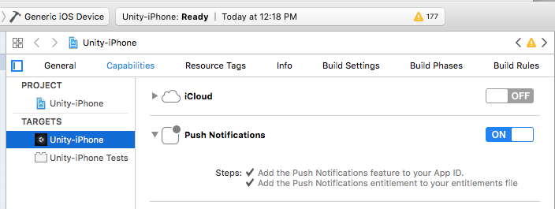

# Airship Unity Plugin

A Unity plugin that integrates the iOS and Android Airship SDK.

### Requirements
 - Unity 5+
 - iOS: Xcode 11+
 - iOS: Minimum deployment target iOS 11+
 - Android: Android SDK installed and updated (requires Android MinSdkVersion = 16)
 - Android: Using Android SDK manager, install 28+. If Custom Gradle Template is used, the gradle template needs to be configured to use API VERSION 28+.

### Resources:
 - [Getting started guide](https://docs.airship.com/platform/unity/getting-started/)
 - [API Docs](https://docs.airship.com/reference/libraries/unity/latest/)
 - [Migration Guide](Documentation/migration-guide.md)

### Third Party Packages
 - [External Dependency Manager for Unity](https://github.com/googlesamples/unity-jar-resolver) - Apache License

## Quickstart
1. [Download](https://github.com/urbanairship/ua-unity-plugin/releases/latest) the latest `unitypackage`
2. Import Airship `unitypackage`: In Unity, Assets -> Import Package -> Custom Package
3. Configure Airship: In Unity, Window -> Urban Airship -> Settings

An example script is provided in 'Scripts/UrbanAirshipBehaviour.cs'. Import into your app's
scripts and attach it to a game object in each scene. The script shows a very basic
integration with Airship.

### iOS
Enable Push Notifications in the project editor's Capabilities pane:



To add support for iOS 10 notification attachments, you will need to create a
notification service extension. Detailed steps can be found
[here](https://docs.airship.com/platform/unity/getting-started/).

### Android
Download google-services.json into the `Assets` directory from the application's firebase console.

If proguard is enabled, add Airship settings to the proguard-user.txt file.
```
-keep public class com.urbanairship.unityplugin.UnityPlugin
-keepclassmembers class com.urbanairship.unityplugin.UnityPlugin {
  public <methods>;
  public <fields>;
  static <methods>;
}
```
