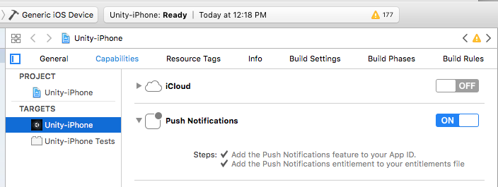

# Airship Unity Plugin

A Unity plugin that integrates the Airship iOS and Android SDKs, exposing a single
cross-platform C# API. Apps can share the same integration code across both platforms.

### Requirements
 - Unity 6+
 - iOS: Xcode 16+
 - iOS: Minimum deployment target iOS 15+
 - Android: minSdkVersion 23, compileSdk/targetSdk 36
 - Android: Kotlin 2.2.20

### Resources
 - [Getting started guide](https://www.airship.com/docs/developer/sdk-integration/unity/installation/getting-started)
 - [Migration Guide](Documentation/migration-guide.md)

### Third Party Packages
 - [External Dependency Manager for Unity](https://github.com/googlesamples/unity-jar-resolver) - Apache License

## Quickstart
1. [Download](https://github.com/urbanairship/ua-unity-plugin/releases/latest) the latest `unitypackage`
2. Import the Airship `unitypackage`: In Unity, Assets -> Import Package -> Custom Package
3. Configure Airship using one of the two options below.

### Configure with the editor (Settings window)
In Unity, open Window -> Airship -> Settings and enter your app key/secret and options.
This generates the native `AirshipConfig.plist` (iOS) and `airship_config.xml` (Android).

### Configure at runtime (TakeOff)
Alternatively, call `TakeOff` early in your app lifecycle:

```csharp
using AirshipSDK;

Airship.Shared.TakeOff(new AirshipConfig() {
    @default = new ConfigEnvironment() {
        appKey = "<APP_KEY>",
        appSecret = "<APP_SECRET>",
        logLevel = LogLevel.Verbose,
    },
    site = Site.US, // use Site.EU for EU cloud projects
    inProduction = false,
    urlAllowList = new string[] { "*" },
});
```

An example script is provided in `Assets/Scripts/AirshipBehaviour.cs`. Import it into your
app's scripts and attach it to a game object in a scene for a basic integration reference.

## API
All features are accessed through `Airship.Shared`:

 - `channel` - channel ID, tags, tag groups, attributes, subscription lists
 - `contact` - named user, tags, attributes, subscription lists
 - `push` - notification opt-in, push token, notification status
 - `messageCenter` - Message Center
 - `preferenceCenter` - Preference Center
 - `inApp` - In-App Automation / Experiences
 - `analytics` - screen tracking, custom events, associated identifiers
 - `privacyManager` - enable/disable data collection features
 - `featureFlagManager` - feature flags
 - `locale` - locale overrides
 - `actions` - Actions
 - `liveActivityManager` (iOS)
 - `liveUpdateManager` (Android)

Events such as `OnPushReceived`, `OnPushOpened`, `OnChannelCreated`, `OnDeepLinkReceived`,
`OnInboxUpdated`, and `OnNotificationStatusChanged` are exposed on `Airship.Shared`.

### iOS
Enable Push Notifications in the project editor's Capabilities pane:



The plugin ships native code as Swift and supports Swift Package Manager. For notification
attachments/services, create a notification service extension. See the
[getting started guide](https://www.airship.com/docs/developer/sdk-integration/unity/installation/getting-started).

### Android
Download `google-services.json` into the `Assets` directory from the application's Firebase console.
The plugin converts it into Android resources during the build (controlled by the
"Process google-service" setting in the Settings window).

If proguard is enabled, add the Airship plugin keep rules to `proguard-user.txt`:
```
-keep public class com.urbanairship.unityplugin.UnityPlugin
-keepclassmembers class com.urbanairship.unityplugin.UnityPlugin {
  public <methods>;
  public <fields>;
  static <methods>;
}
```
